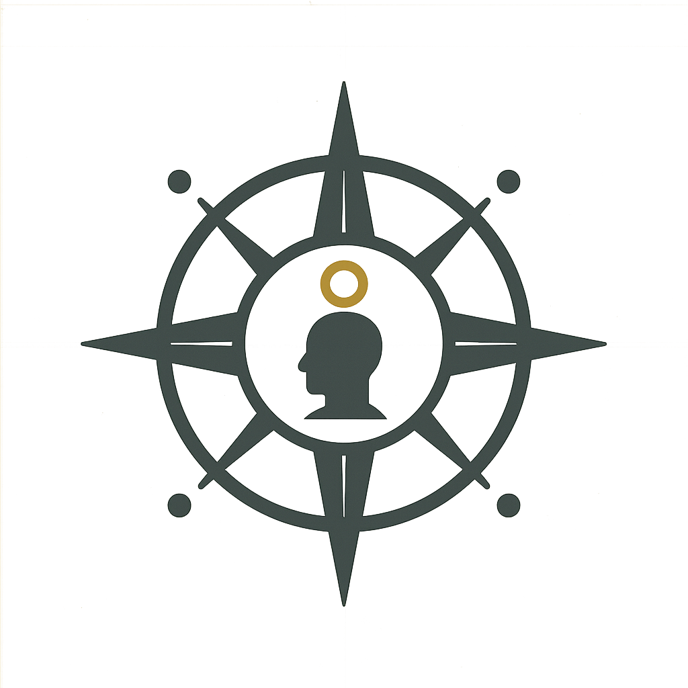

# Outline: The Truth Traveler's Compass: A Quick-Start Guide

This document outlines the structure for a concise, practical primer to "The Truth Traveler's Compass," designed to be accessible for a younger (13+) audience. It serves as an introduction or "Cliff Notes with pointers" to the main manuscript.

---

*The Semantic Compass: attunement axis for Civic AI companions.*

*The Truth Traveler’s Glyph: symbolic signature of discernment and resonance calibration.*

---

**1. Your Mission, Should You Choose to Accept It (The Introduction)**
    * A brief, one-paragraph welcome. The Fog Zone is real, but you already have the tools to navigate it. This guide is your first map.

**2. The Three Tools You Were Born With**
    * A punchy, one-page overview of the core human tools:
        * **Instinct:** Your Gut-Check Alarm.
        * **Clarity:** Your Pattern-Spotting Brain.
        * **Curiosity:** Your "Why?" Engine.

**3. The Mini-Compass: Your First Piece of Gear**
    * A clear, simple breakdown of the condensed 5-step Clarity Compass:
        1.  **Pause:** Don't react.
        2.  **Source:** Who's talking?
        3.  **Emotion:** What do they want you to feel?
        4.  **Opposition:** Ask, "Who disagrees?"
        5.  **Decide:** What's the next wise move?

**4. Field Test: Let's Walk the Compass**
    * A practical, guided walkthrough of the 5 steps using a single, realistic example (e.g., a viral TikTok video or Instagram rumor).

**5. Your Next Destination (The Pointers)**
    * A "Where to Go from Here" section that briefly introduces concepts from the main manuscript, pointing the reader toward the full book for a deeper dive.
        * "Ready to level up? Learn about the **Stakes Matrix**..."
        * "Want to see the bigger picture? Explore the **Signal Mesh**..."

**6. The Journey Continues**
    * A brief, empowering sign-off. You've taken your first steps and calibrated your compass. The full journey awaits in the main guide.
